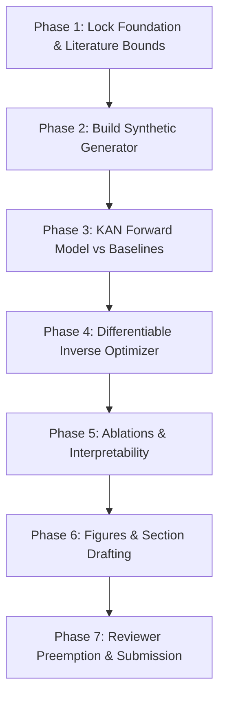

# Project Master Context: HiPCO Carbon Nanotube KAN Decision Support System & Research Paper

> **Document Purpose**: This is the complete, self-contained project master context file designed to be fed directly into AI assistants (such as Claude, ChatGPT, or Antigravity) to guide development, code generation, statistical validation, and paper writing across all 7 phases and 60 steps of the project.

---

## 1. Project Header & Identity

- **Paper Title**: *"A Physics-Augmented Kolmogorov-Arnold Decision Support System for Quality Prediction and Inverse Recipe Recommendation in a HiPCO Carbon Nanotube Reactor"*
- **Target Venue**: IEEE 2-Column Conference / Journal Format (6–8 pages), targeting applied ML in physical sciences/materials (e.g., NeurIPS/ICML Physical Sciences Workshops, IEEE ICMLA, *Digital Chemical Engineering*, or *MDPI Processes*).
- **Core Domain**: Process Systems Engineering + Machine Learning + Nanomaterials Synthesis.
- **Repository Location**: `c:\Users\aaksh\Downloads\paper\`
- **Isolated Package Directory**: `c:\Users\aaksh\Downloads\paper\nopo_paper_pkg\`

---

## 2. Executive Problem Statement & Novelty Framing

### The Core Problem
High-pressure carbon monoxide (HiPCO) gas-phase disproportionation ($2\text{CO} \rightleftharpoons \text{C} + \text{CO}_2$) produces high-purity single-walled carbon nanotubes (SWCNTs). However, batch quality ($G/D$ ratio, UV-Vis purity, metal impurities Fe/Ni/Cr ppm) is highly non-linear, sensitive to thermal/flow perturbations, and real industrial production data is extremely scarce ($N = 12 \dots 50$ production batches behind a proprietary wall).

### Pinned Novelty Statement (Section 1.2 of Senior Advisor Roadmap)
> *"We present the first end-to-end machine-learning decision support system for a high-pressure carbon monoxide (HiPCO) single-walled carbon nanotube reactor, spanning OPC-UA historian ingestion, first-principles feature computation, forward quality prediction, and inverse recipe recommendation. To overcome extreme batch-level data scarcity, we use a validated 167-formula process engine as a physically grounded synthetic-data generator and train a Kolmogorov-Arnold Network (KAN) surrogate whose learnable spline activations expose process-to-quality relationships and whose differentiability enables gradient-based inverse optimization of setpoints under physics-feasibility constraints. We benchmark the KAN against the deployed XGBoost and PLS baselines on withheld real batches, and report the interpretability structure recovered from the reactor."*

---

## 3. Prior Art & Threatening Literature Positioning

To avoid desk rejection, the project explicitly positions against 5 published benchmarks:

1. **ACS Nano Forest-Synthesis Study**: Uses XGBoost to predict $G/D$ ratio in SWCNT forest CVD.
   - *Our Delta*: Gas-phase HiPCO reactor physics, 167-formula physics engine augmentation, differentiable KAN inverse optimization.
2. **Fricz et al. (2026, Digital Chemical Engineering 18:100289)**: KAN soft sensor for industrial product quality.
   - *Our Delta*: First application to a HiPCO reactor, synthetic data bootstrapping strategy under extreme data scarcity.
3. **Guo et al. (2026, Computers & Chemical Engineering 210:109612)**: KAN soft sensors for process data.
   - *Our Delta*: End-to-end decision support system combining OPC-UA ingestion, first-principles engine, and inverse recipe optimization loop.
4. **KINN (Wang et al., 2025, CMAME 433:117518)**: Physics-informed KAN solving forward and inverse problems.
   - *Our Delta*: Industrial gas-phase reactor case study with 167-formula thermodynamic and fluid mechanics constraints.
5. **Fronzi et al. (2025) / Tung et al. (2025, J. Chem. Phys.)**: KAN forward prediction plus inverse materials design.
   - *Our Delta*: Process setpoint optimization constrained by physical flow, nozzle choke, and thermal feasibility penalties.

---

## 4. Feature Selection & Physics Schema

From 110 raw DCS/OPC-UA historian channels in real production logs (`RX_ML_training.xlsx`), we perform an **84% dimensionality reduction** down to **18 input features** (7 controllable setpoints + 11 physics engine parameters) and **9 quality targets**:

### A. Process Control Setpoints ($d=7$)
| Parameter Name | Process Variable | Range Min | Range Max | Unit | Primary Citation |
| :--- | :--- | :--- | :--- | :--- | :--- |
| `P_CO_atm` | Total Reactor Pressure | 10.0 | 90.0 | atm | Nikolaev et al. (1999) |
| `T_rxn_mean_C` | Growth Zone Mean Temp | 800.0 | 1150.0 | °C | Bronikowski et al. (2001) |
| `T_spread_C` | Radial/Axial Thermal Gradient | 0.0 | 80.0 | °C | HiPCO Thermal Zone Specs |
| `Flow_CO_SLPM` | Main CO Gas Flow | 100.0 | 1000.0 | SLPM | Dateo et al. (2002) |
| `Flow_Fe_Precursor_SLPM` | $\text{Fe(CO)}_5$ Precursor Feed | 10.0 | 350.0 | SLPM | Bronikowski et al. (2001) |
| `H2O_Flow_ppmv` | Trace $\text{H}_2\text{O}$ Moderation | 1.0 | 50.0 | ppmv | Dateo et al. (2002) |
| `Zone_SP_Dev_C` | Max Setpoint Deviation | -35.0 | 15.0 | °C | Production Historian |

### B. Derived Secondary Parameters (167-Formula Physics Engine Outputs) ($11$)
1. `Residence_Time_s`: Gas residence time $\tau = V_{\text{reactor}} / Q_{\text{actual}}(P, T)$ (s)
2. `Reynolds_Number`: Flow regime indicator $\text{Re} = \rho v D / \mu(T)$
3. `Fe_Concentration_ppm`: Precursor iron vapor concentration ($\text{mol/m}^3$)
4. `CO_Disproportionation_DrivingForce`: Boudouard overpotential $\Delta G / RT$
5. `Thermal_Loss_kW`: Radial heat dissipation to cooling jacket (kW)
6. `P_CO2_Partial_bar`: Equilibrium $\text{CO}_2$ backpressure (bar)
7. `Nucleation_Rate_Est`: Estimated Fe cluster nucleation rate ($J \propto C_{\text{Fe}}^2 \exp(-E_a/RT)$)
8. `Linear_Gas_Velocity_m_s`: Actual gas flow speed in nozzle region (m/s)
9. `Catalyst_Growth_Time_Ratio`: Ratio $\tau_{\text{growth}} / \tau_{\text{residence}}$
10. `Thermal_Boundary_Thickness_mm`: Boundary layer thickness $\delta_T \propto \sqrt{\nu x / U}$ (mm)
11. `Water_CO_Ratio_ppm`: Effective $\text{H}_2\text{O} / \text{CO}$ molar ratio (ppm)

### C. Quality Target Variables ($9$)
1. `DWM_G/D`: Raman $G/D$ intensity ratio (Crystallinity / defect density) [Target mean: $15.31 \pm 2.39$]
2. `DWM_Purity_UV`: UV-Vis optical purity % [Target mean: $41.00\% \pm 7.25\%$]
3. `DWM_Yield_g`: SWCNT batch yield (g) [Target mean: $1.57\text{g} \pm 0.96\text{g}$]
4. `DWM_Fe_ppm_Axial` & `DWM_Fe_ppm_Radial`: Iron residual content (ppm) [Target mean: $\sim 303,053\text{ ppm}$]
5. `DWM_Ni_ppm_Axial` & `DWM_Ni_ppm_Radial`: Nickel impurity from alloy erosion (ppm) [Target mean: $\sim 1,256\text{ ppm}$]
6. `DWM_Cr_ppm_Axial` & `DWM_Cr_ppm_Radial`: Chromium impurity from wall oxidation (ppm) [Target mean: $\sim 1,332\text{ ppm}$]

---

## 5. Master 7-Phase Execution Plan (60 Steps)



### Phase 1: Lock Foundation (Steps 1–5) [COMPLETED]
- Review 5 threatening papers and write literature notes (`literature_notes.md`).
- Pin novelty statement (`novelty_statement.md`).
- Select target venue (IEEE 2-column, 6–8 pages).
- Set up isolated directory (`nopo_paper_pkg/`).
- Compile literature-bounded parameter reference table (`parameter_bounds_reference.csv`).

### Phase 2: Build Synthetic Data Generator (Steps 6–18) [COMPLETED]
- Script: `synthetic_generator.py`
- Extract empirical correlation matrix $C \in \mathbb{R}^{7 \times 7}$ from real batch setpoints (`RX_ML_training.xlsx`).
- Execute Sobol / LHS sampling with Gaussian copula transformation.
- Run 167-formula engine for 11 secondary features.
- Fit parametric response surfaces for quality targets $Y$.
- Inject 5% Raman, 4% UV, 8% ICP-MS heteroscedastic measurement noise.
- Inject sensor calibration noise ($\pm 0.5^\circ\text{C}$ RTD, $\pm 0.05\text{ atm}$ PT, 0.5% MFC).
- Model real missingness patterns (15% ICP metals, 10% UV, 5% Raman).
- Impose regime imbalance (70% nominal, 20% high-yield, 10% edge).
- Generate Datasets:
  - Large Synthetic Set ($N=5000$): `SWCNT_synthetic_5000.xlsx` / `.csv`
  - Matched Validation Set ($N=50$): `SWCNT_synthetic_50_matched.xlsx` / `.csv`
- Execute physical sanity assertions ($\tau_{\text{res}} > 0$, $v > 0$, $2.0 \le G/D \le 60.0$).
- Compile Data Card: `data_card.md` (Section IV of paper).
- Quantitative Verification: `evaluate_dataset.py` -> `dataset_evaluation_report.md` (Frobenius norm error $\|C_{\text{real}} - C_{\text{synth}}\|_F = 0.0493 < 0.15$).

### Phase 3: Forward Model (Steps 19–27) [CURRENT IN-PROGRESS]
- Script: `forward_pipeline.py`, `kan_model.py`
- Unified `StandardScaler` pipeline for features and targets.
- Implement PyTorch B-spline PyKAN surrogate architecture (1–2 layers, grid size 3–5).
- Pre-train KAN on $N=5000$ synthetic dataset.
- Fine-tune KAN on real production batches using Repeated K-Fold Cross-Validation.
- Benchmark XGBoost and PLS baselines on identical CV splits.
- Compute $R^2$ and Normalized MAE ($\text{NMAE}$) per quality target.
- Execute **Data-Scarcity Ablation Curve**: Evaluate CV performance across real sample sizes $N \in \{5, 10, 20, 35, 50\}$ with vs. without synthetic pre-training.

### Phase 4: Inverse Model (Steps 28–35)
- Script: `inverse_optimizer.py`
- Freeze trained PyKAN forward surrogate weights $f_{\text{KAN}}(\boldsymbol{x})$.
- Formulate differentiable loss function with physics feasibility penalties:
  $$\mathcal{L}_{\text{inv}}(\boldsymbol{x}) = \| f_{\text{KAN}}(\boldsymbol{x}) - \boldsymbol{y}_{\text{target}} \|_2^2 + \lambda_{\text{feas}} \sum_{i} \max\left(0, g_i(\boldsymbol{x})\right)^2$$
- $g_i(\boldsymbol{x}) \le 0$ enforces thermal gradient stability, nozzle choke limits, and flow bounds.
- Implement multi-start L-BFGS / Adam optimization (20+ seeds) through PyTorch autograd to produce uncertainty spread bands.
- Stand up PLS analytical inverse and KNN output-space backtracker baselines.
- Score via **Recipe Error** (setpoint distance to real optimum) and **Re-simulated Quality Error** (re-running recommended setpoints back through the 167-formula physics engine).

### Phase 5: Ablations & Interpretability (Steps 36–42)
- Script: `interpretability_analysis.py`
- Noise Robustness Ablation: Evaluate forward performance under $0\%, 5\%, 10\%, 20\%$ sensor noise.
- Ensemble Ablation: Evaluate KAN + XGBoost stacked ensemble vs standalone KAN.
- KAN Pruning & Symbolic Snapping (KAN 2.0 style): Prune low-magnitude spline nodes and fit closed-form symbolic equations.
- Spline Activation Plots: Generate publication-ready visualizations for top 4 inputs ($P_{\text{CO}}$, $T_{\text{rxn}}$, $Q_{\text{CO}}$, $Q_{\text{catalyst}}$).
- Physics Cross-Check: Validate learned spline curves against HiPCO gas-phase kinetics (monotonic vs threshold behavior).

### Phase 6: Figures & Section Drafting (Steps 43–53)
- Script: `generate_figures.py`, Draft: `paper_draft.md`
- Generate 5 Essential Publication Figures:
  1. `fig1_system_architecture.png` (Historian -> Physics Engine -> KAN Forward/Inverse -> Operator UI).
  2. `fig2_forward_inverse_performance.png` (Predicted vs Actual & Recipe Error Comparison).
  3. `fig3_data_scarcity_ablation.png` ($R^2$ vs Real Sample Size with/without synthetic pre-training).
  4. `fig4_kan_spline_activations.png` (Learned physical spline shapes for key inputs).
  5. `fig5_inverse_uncertainty_bands.png` (Multi-start optimizer trajectories and confidence intervals).
- Section Writing Order: Section III (System & Pipeline) -> Sec IV (Data Methodology) -> Sec V (KAN Forward & Inverse) -> Sec VI (Experiments & Results) -> Sec VII (Interpretability) -> Sec II (Related Work) -> Sec I (Introduction) -> Sec VIII (Limitations) -> Abstract & Title.

### Phase 7: Preempting Objections & Final Submission (Steps 54–60)
- Preempt 4 major reviewer objections (circular synthetic data, prior KAN soft sensors, no physical run, small sample size).
- Confirm 100% anonymized/normalized proprietary values.
- Verify literature citations for all parameter bounds.
- Trim to IEEE 6-page double-column standard limit.
- Final proofreading and IEEE template compilation.

---

## 6. Directory Structure & File Map

```
c:\Users\aaksh\Downloads\paper\
├── HiPCO_KAN_Paper_Roadmap.pdf      # Senior Advisor Roadmap PDF
├── roadmap_extracted.txt            # Full Extracted Text of Roadmap
├── CLAUDE_PROJECT_CONTEXT.md        # THIS MASTER CONTEXT FILE
└── nopo_paper_pkg\                  # Isolated Development Package
    ├── literature_notes.md          # Threatening literature notes (Phase 1)
    ├── novelty_statement.md         # Pinned Novelty Statement (Phase 1)
    ├── parameter_bounds_reference.csv # Bounded parameter reference table (Phase 1)
    ├── synthetic_generator.py       # Phase 2 Synthetic Data Generator Script
    ├── SWCNT_synthetic_5000.csv     # N=5000 Large Synthetic Dataset
    ├── SWCNT_synthetic_5000.xlsx    # N=5000 Excel Format
    ├── SWCNT_synthetic_50_matched.csv # N=50 Matched Validation Dataset
    ├── SWCNT_synthetic_50_matched.xlsx# N=50 Excel Format
    ├── data_card.md                 # Dataset Card for Section IV
    ├── evaluate_dataset.py          # Quantitative Dataset Evaluation Script
    ├── dataset_evaluation_report.md # Statistical Evaluation Report
    ├── forward_pipeline.py          # [Phase 3] KAN Forward Model & Baselines Pipeline
    ├── kan_model.py                 # [Phase 3] PyTorch PyKAN Architecture Module
    ├── inverse_optimizer.py         # [Phase 4] Differentiable Physics-Constrained Inverse Optimizer
    ├── interpretability_analysis.py # [Phase 5] KAN Pruning & Symbolic Snapping Script
    ├── generate_figures.py          # [Phase 6] Publication Figures Generator (1-5)
    └── paper_draft.md               # [Phase 6] Complete IEEE Paper Draft
```

---

## 7. Key Execution Commands

To execute and verify each module of the project from the shell:

```bash
# 1. Generate Synthetic Datasets & Data Card (Phase 2)
python nopo_paper_pkg/synthetic_generator.py

# 2. Evaluate Synthetic Data against Real Production Batches (Phase 2 Verification)
python nopo_paper_pkg/evaluate_dataset.py

# 3. Train KAN Forward Model, Baselines & Data-Scarcity Ablation (Phase 3)
python nopo_paper_pkg/forward_pipeline.py

# 4. Run Differentiable Physics-Constrained Inverse Optimization (Phase 4)
python nopo_paper_pkg/inverse_optimizer.py

# 5. Execute KAN Pruning, Symbolic Snapping & Interpretability (Phase 5)
python nopo_paper_pkg/interpretability_analysis.py

# 6. Export 5 Publication Figures (Phase 6)
python nopo_paper_pkg/generate_figures.py
```

---

> **End of Context File**. You can now feed this file into Claude or any LLM workspace.
