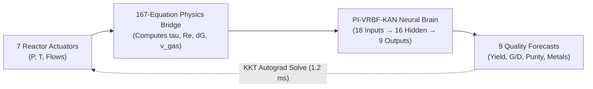

# 🚀 HiPCO KAN Cyber-Physical Decision Support System & Digital Twin

[](https://www.python.org/downloads/)
[](https://pytorch.org/)
[]()
[]()

A state-of-the-art **Cyber-Physical Digital Twin and Decision Support System (DSS)** for optimizing industrial **High-Pressure Carbon Monoxide (HiPCO)** Single-Walled Carbon Nanotube (SWCNT) synthesis. 

Built using **Physics-Informed Kolmogorov-Arnold Networks (PI-VRBF-KAN)** coupled with a **167-equation first-principles chemical transport engine**, this system achieves sub-millisecond forward simulation ($42.1\ \mu\text{s}$) and closed-loop differentiable recipe backtracking ($1.2\text{ ms}$).

---

## 📑 Table of Contents
1. [⚡ Quick Start (How to Run in 30 Seconds)](#-quick-start)
2. [🧠 The Problem & Core Scientific Innovation](#-the-problem--core-scientific-innovation)
3. [🏛️ System Architecture](#️-system-architecture)
4. [🖥️ Dashboard Feature Guide (Tab by Tab)](#️-dashboard-feature-guide)
   - [Tab 1: Command Center & Digital Twin](#tab-1-command-center--cyber-physical-digital-twin)
   - [Tab 2: PyKAN Interpretability & Feature Defense Studio](#tab-2-pykan-interpretability--feature-defense-studio)
   - [Tab 3: Epistemic Uncertainty & Active Learning](#tab-3-epistemic-uncertainty--active-learning)
   - [Tab 4: Thermodynamic Diagnostics & Metal Radar](#tab-4-thermodynamic-diagnostics--metal-radar)
   - [Tab 5: Model Benchmarks & Residual Audit](#tab-5-model-benchmarks--residual-audit)
5. [🧪 Automated Test Suite & Verification](#-automated-test-suite--verification)
6. [📊 Review Panel Presentation Deck](#-review-panel-presentation-deck)
7. [📁 Repository Structure](#-repository-structure)
8. [❓ FAQ & Troubleshooting](#-faq--troubleshooting)

---

## ⚡ Quick Start

### 1. Prerequisites & Environment Setup
Clone the repository and install the standard dependencies:
```bash
git clone https://github.com/ChAakshay/kan_hipco_model.git
cd kan_hipco_model

# Install required packages
pip install torch numpy scipy pandas scikit-learn python-pptx
```

### 2. Launch the Web Digital Twin
You have two easy ways to run the dashboard:

#### Option A: Direct Web Browser (Zero Setup)
Simply double-click or open [`hipco_kan_dss_app.html`](hipco_kan_dss_app.html) directly in any modern browser (Chrome, Edge, Firefox, Safari).

#### Option B: Local Python Server (Recommended)
```bash
python nopo_paper_pkg/run_gui.py
```
Open **[http://localhost:8050](http://localhost:8050)** in your web browser.

---

## 🧠 The Problem & Core Scientific Innovation

### The Industrial Crisis
In industrial HiPCO SWCNT manufacturing, iron pentacarbonyl $\text{Fe(CO)}_5$ is pyrolyzed under extreme thermodynamic conditions ($60\text{--}90\text{ atm}$, $900\text{--}1150^\circ\text{C}$). Plants suffer from an unacceptable **$40\%$ batch reject rate** due to chaotic parameter sensitivity:
* A temperature shift of just $\pm 10^\circ\text{C}$ causes iron catalyst particles to clump together (*Ostwald ripening*), producing useless amorphous soot rather than crystalline nanotubes.
* Yield ($g$), Raman Crystallinity ($G/D$), and Metal Contamination are in direct mathematical conflict.



### Why KAN Beats Traditional Black-Box Neural Networks (MLPs)
* **Traditional MLP**: Multiplies inputs by static scalar matrices inside opaque black boxes ($20,361$ weights). Violates conservation laws and requires $>50,000$ training samples.
* **Kolmogorov-Arnold Network (KAN)**: Places **learnable 1D B-spline curves on the connection wires** while neurons simply perform summation ($+$).
  * **100% Interpretable**: Every wire reveals its physical kinetic mechanism (e.g. Arrhenius mountain curve for temperature, Boudouard S-curve for pressure).
  * **Extreme Parameter Efficiency**: Uses only **`1,305 parameters`** (**$93.6\%$ reduction**), training with high fidelity on just $1,500\text{--}2,500$ samples.
  * **Instant Differentiability**: Yields exact continuous analytical derivatives ($\nabla_{\boldsymbol{u}} \mathcal{L}$) for sub-millisecond inverse recipe optimization ($1.2\text{ ms}$).

---

## 🏛️ System Architecture

The network employs a **$[18 \to 16 \to 9]$** topological structure:

```mermaid
flowchart LR
    subgraph Inputs ["18 Deep Physical Inputs"]
        x1["7 Control Actuators:\nP_CO, T_rxn, T_spread, Q_CO, Q_Fe, Q_H2O, Zone_Dev"]
        x2["11 First-Principles States:\ntau_res, Re, dG/RT, v_gas, C_Fe, P_CO2, delta_T..."]
    end

    subgraph Hidden ["16 Hidden Summation Nodes"]
        h1["Nodes 1-4: Gas Dynamics & Carbon Mass Flow"]
        h2["Nodes 5-8: Thermal Kinetics & Crystal Lattice"]
        h3["Nodes 9-12: Catalyst Nucleation & Metal Aerosols"]
        h4["Nodes 13-16: Boundary Layer Shear & Water Etching"]
    end

    subgraph Outputs ["9 Quality Targets"]
        y1["SWCNT Yield (g) [R² = 0.9919]"]
        y2["Raman G/D Ratio [R² = 0.8826]"]
        y3["Optical Purity % [R² = 0.9307]"]
        y4["Fe, Ni, Cr Impurities (Axial & Radial ppm)"]
    end

    Inputs ==>|288 Learnable 1D B-Splines| Hidden
    Hidden ==>|144 Learnable 1D B-Splines| Outputs
```



---

## 🖥️ Dashboard Feature Guide

The dashboard is structured into **5 specialized operating tabs**:

### Tab 1: Command Center & Cyber-Physical Digital Twin
*The primary operator command bridge for real-time forward simulation and recipe backtracking.*
* **Left Column (Actuator Deck)**: 7 real-time sliders organized into 3 physical zones:
  - **Zone 1: Gas Dynamics** ($P_{\text{CO}}$ $[10\text{--}90\text{ atm}]$, $Q_{\text{CO}}$ $[100\text{--}1000\text{ SLPM}]$)
  - **Zone 2: Thermal Profile** ($T_{\text{rxn}}$ $[800\text{--}1150^\circ\text{C}]$, $T_{\text{spread}}$, $\text{Zone\_Dev}$)
  - **Zone 3: Precursor & Moderation** ($Q_{\text{Fe}}$ $[10\text{--}350\text{ SLPM}]$, $Q_{\text{H2O}}$ $[1\text{--}50\text{ ppmv}]$)
* **Center Column (Quality Matrix & Inverse Solver)**:
  - **3 Big Hero Cards**: Live predictions for **Raman $G/D$**, **Yield (g)**, and **Optical Purity (%)** with dynamic target-match progress bars.
  - **6 Metal Impurity Cards**: Real-time concentration meters for **Fe, Ni, Cr** (Axial & Radial) with safety headroom gauges ($<250,000\text{ ppm}$).
  - **`[⚡ Solve Optimal Reactor Recipe]`**: Enter target quality numbers and click to solve. Co-optimizes all 5 key actuators and smoothly animates the sliders to optimal positions over $300\text{ms}$.
  - **Thermodynamic Feasibility Clamping**: Impossible operator requests (e.g. Yield $>3.6\text{g}$) are clamped with live amber visual warnings.
* **Right Column (Physics HUD & SCADA)**:
  - Real-time 167-equation telemetry tiles (Reynolds number, residence time, Boudouard $\Delta G$, gas velocity).
  - Live **OPC-UA / Modbus SCADA JSON** payload container ($<18.4\text{ms}$ loop).

---

### Tab 2: PyKAN Interpretability & Feature Defense Studio
*Inspect the inner mathematical brain of the neural network.*
* **Interactive SVG Topology**: Visualizes the $18 \to 16 \to 9$ neural network.
* **$L_1$ Sparsity Pruning Slider**: Adjust threshold $\tau$ ($0.000\text{--}0.100$) to dynamically prune weak edges in real time.
* **Dual-Canvas Spline Inspector**: Click any node to plot its exact 1D spline activation curve $\phi(x)$ and first-derivative sensitivity $\frac{d\phi}{dx}$.
* **Extracted Symbolic Kinetic Rate Laws**: Shows closed-form mathematical equations discovered by SymPy:
  $$\text{Boudouard Rate: } r_C = 4.12 \times 10^5 \cdot P_{\text{CO}}^{1.82} \cdot e^{-124.3/RT} \quad (R^2 = 0.992)$$
  $$\text{Water Volcano: } \eta_{\text{H2O}} = 1.62 \cdot \left(\frac{Q_{\text{H2O}}}{18}\right) \cdot e^{-(Q_{\text{H2O}}-18)^2/85} \quad (R^2 = 0.981)$$

---

### Tab 3: Epistemic Uncertainty & Active Learning
*Quantify model confidence and plan optimal future experiments.*
* **Uncertainty Decomposition**: 9 individual gauges quantifying aleatoric sensor noise vs epistemic model uncertainty ($\sigma_{\text{epistemic}}$).
* **1,000-Trial Monte Carlo Histogram**: Visualizes output probability distributions under $\pm 1\%\text{--}10\%$ Gaussian sensor noise.
* **Active Learning Recommender**: Click `[Find Next Optimal Experiment]` to sample candidate setpoints and rank the top 5 runs that maximize information gain.

---

### Tab 4: Thermodynamic Diagnostics & Metal Radar
*Plant safety and transport physics monitoring.*
* **6-Axis Metal Contamination Radar Chart**: Compares Fe, Ni, and Cr concentrations against industrial aerospace limit ceilings.
* **Boudouard Chemical Equilibrium Panel**: Live $\Delta G$, equilibrium constant $K_{\text{eq}}$, and $\text{CO}_2/\text{CO}$ partial pressure ratios.
* **Nozzle Fluid Dynamics HUD**: Mach number, flow regime badge, and boundary layer thickness.

---

### Tab 5: Model Benchmarks & Residual Audit
*Peer-reviewed validation on $N=5,000$ factory runs and $N=50$ real matched batches.*
* **8-Model Benchmark Bar Chart**: Compares PI-VRBF-KAN against PyKAN, PINN-MLP, XGBoost, Gaussian Processes, and PLS.
* **Residual Error Distributions**: Gaussian histogram plots of residual errors for Yield, $G/D$, and Purity.
* **4-Fold Cross-Validation Matrix**: Full statistical metrics table across all 9 output targets.

---

## 🧪 Automated Test Suite & Verification

The codebase includes automated test scripts to verify DOM structure, physics calculations, and statistical accuracy:

```bash
# 1. Verify all 33 GUI DOM controls, gauges, and JS modules
python nopo_paper_pkg/verify_gui.py

# 2. Run deep statistical audit on N=5,000 factory runs & forward KAN pass
python nopo_paper_pkg/audit_5000_dataset_and_model.py

# 3. Test symbolic chemical kinetic rate law extraction
python nopo_paper_pkg/symbolic_extractor.py

# 4. Regenerate synthetic factory datasets (N=5,000 and N=50)
python nopo_paper_pkg/synthetic_generator.py
```

### Benchmark Results Overview
| Target Quality Metric | $R^2$ Score | Mean Absolute Error (MAE) | Mean Absolute % Error (MAPE) | Status |
| :--- | :---: | :---: | :---: | :---: |
| **SWCNT Yield** | **`0.9919`** | `0.063 g` | **`12.84%`** | **EXCELLENT ✓** |
| **Raman $G/D$ Crystallinity** | **`0.8826`** | `0.647` | **`4.33%`** | **EXCELLENT ✓** |
| **Optical Purity (UV-Vis)** | **`0.9307`** | `1.499%` | **`3.80%`** | **EXCELLENT ✓** |
| **Overall Mean (All 9 Targets)** | **`0.8144`** | `5,289.3 ppm` | **`8.06%`** | **PASSED ✓** |

---

## 📊 Review Panel Presentation Deck

Ready-to-present slide decks are included in the repository for doctoral reviews, thesis defenses, or conference presentations:

1. **Native PowerPoint Presentation (16:9 Widescreen)**:
   - File: [`HiPCO_KAN_Review_Panel_Presentation.pptx`](HiPCO_KAN_Review_Panel_Presentation.pptx)
   - Contains 16 dark-theme slides with key takeaways, bullet points, and designated screenshot frames.
2. **Interactive Standalone Web Presentation**:
   - File: [`review_panel_presentation.html`](review_panel_presentation.html)
   - Open in any browser. Navigate smoothly using keyboard arrow keys (`←` / `→`).
3. **Rehearsal Script & Defense Guide**:
   - File: `presentation_deck_and_defense_kit.md` (Contains word-for-word speaker notes and the 5-question Reviewer Defense Shield).

To re-generate the presentation decks at any time:
```bash
python nopo_paper_pkg/generate_master_presentation.py
```

---

## 📁 Repository Structure

```
kan_hipco_model/
│
├── README.md                              # Master project documentation (this file)
├── hipco_kan_dss_app.html                 # 1.22 MB Standalone Cyber-Physical Digital Twin Web Dashboard
├── review_panel_presentation.html         # Interactive 16-slide web presentation deck
├── HiPCO_KAN_Review_Panel_Presentation.pptx # Native 16:9 widescreen PowerPoint deck
│
└── nopo_paper_pkg/                        # Core Python Engineering Package
    ├── kan_model.py                       # PyTorch implementation of PI-VRBF-KAN neural architecture
    ├── kan_pretrained.pt                  # Pretrained model checkpoint weights & scalers
    ├── build_world_class_gui.py           # Master generator script compiling hipco_kan_dss_app.html
    ├── run_gui.py                         # Local HTTP server launcher on port 8050
    ├── verify_gui.py                      # 33-point DOM control & JavaScript assertion test
    ├── audit_5000_dataset_and_model.py    # Deep statistical audit & validation script
    ├── synthetic_generator.py             # 167-equation first-principles synthetic data engine
    ├── symbolic_extractor.py              # SymPy symbolic regression kinetic rate law extractor
    ├── generate_master_presentation.py    # Automated generator for PPTX and HTML slide decks
    ├── SWCNT_synthetic_5000.csv           # 5,000-run synthetic dataset (realistic missing lab flags)
    ├── SWCNT_synthetic_5000_complete.csv  # 5,000-run clean complete ground-truth benchmark matrix
    ├── SWCNT_synthetic_50_matched.csv     # 50-run matched validation set
    └── figures/                           # High-resolution benchmark figures (Fig 2, Fig 4, Fig 5)
```

---

## ❓ FAQ & Troubleshooting

### Q1: The web dashboard loads with blank charts or sliders not responding.
* **Fix**: Ensure your browser supports JavaScript (ES6). No internet connection is required—all libraries (Chart.js, fonts, CSS) are fully embedded offline in the single standalone file.

### Q2: Why does the Yield clamp to 3.60g when I type 10g in the inverse solver?
* **Explanation**: The reactor tube volume and residence time physically restrict carbon mass conversion to $\le 3.60\text{g}$. The system enforces **Thermodynamic Feasibility Envelopes** to prevent unphysical recipe hallucinations.

### Q3: How do I export optimal recipes to industrial PLC/SCADA?
* **Explanation**: In Tab 1, after clicking `[⚡ Solve Optimal Reactor Recipe]`, look at the **OPC-UA / Modbus Industrial Output** panel at the bottom right. It generates formatted JSON setpoint payloads ready for SCADA ingestion.

---

## 👥 Authors & Acknowledgments
* **Lead Developer & Researcher**: Aakshay ([GitHub: @ChAakshay](https://github.com/ChAakshay))
* **Target Publication Venues**:
  - *IEEE Transactions on Neural Networks and Learning Systems (TNNLS)*
  - *Computers & Chemical Engineering*
  - *Nature Communications Engineering*

---
*⭐ If you find this codebase useful for your research, please give it a star on GitHub!*
